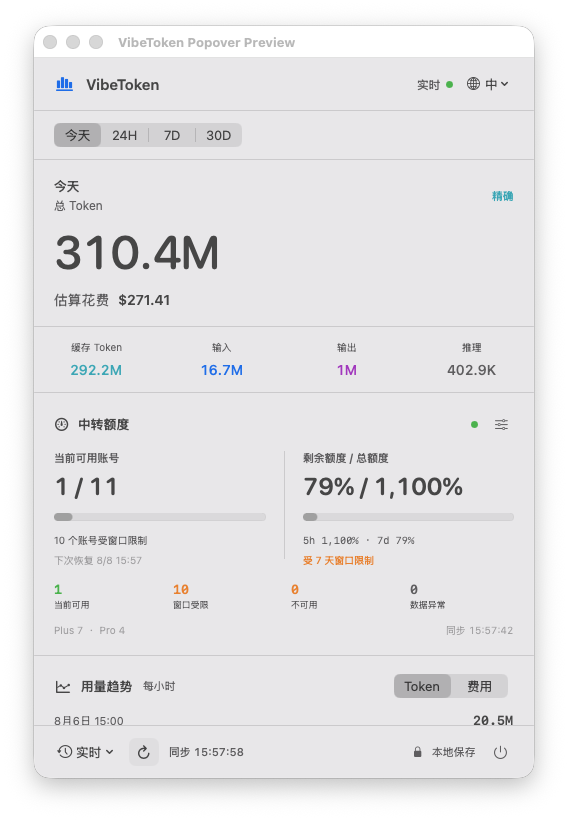

# VibeToken

<p align="center">
  
</p>

<p align="center">
  一个本地优先的 macOS 菜单栏工具，用来查看 AI 编程工具的 Token 用量、估算费用与中转账号池额度。
</p>

<p align="center">
  
  
  
</p>

> [!IMPORTANT]
> VibeToken 目前处于早期预览阶段。Codex Desktop / CLI 已接入真实本地用量；Claude Code、Gemini CLI、OpenCode 等来源仍在路线图中。当前没有经过 Apple Developer ID 签名和公证的公开安装包，请从源码构建。



<p align="center">界面预览，图中为示例数据。</p>

## 它解决什么问题

AI 编程工具通常把用量分散在不同会话、日志和后台页面里。VibeToken 把这些信息收进一个原生 macOS 菜单栏弹框：

- 实时查看 Codex 全会话 Token，而不是模拟增长数字。
- 按模型公开 API 单价估算费用，并明确区分估算与真实账单。
- 查看今天、滚动 24 小时、7 天和 30 天的汇总与趋势。
- 区分输入、缓存、输出和推理 Token。
- 查看模型分布、工具分布和当前会话。
- 可选连接 Sub2API 管理后台，只读查看 OpenAI OAuth 账号池的 5h / 7d 窗口额度。

所有核心统计默认在本机完成。

## 当前支持

| 数据源 | 状态 | 说明 |
| --- | --- | --- |
| Codex Desktop / CLI | 已支持 | 增量读取 `~/.codex/sessions` 中的结构化用量字段 |
| Sub2API 账号池 | 已支持，可选 | 管理员只读查询 OpenAI OAuth/Codex 窗口快照 |
| Claude Code | 计划中 | 尚未实现，不会显示模拟数据 |
| Gemini CLI / OpenCode | 计划中 | 尚未实现 |

VibeToken 不读取 ChatGPT 或 Claude 桌面应用界面中的对话内容，也不会把订阅套餐虚构成精确 Token 账单。

## 安装

### 环境要求

- macOS 14 或更高版本
- Xcode 16 或兼容 Swift 6 的命令行工具
- 已使用过 Codex Desktop 或 Codex CLI，且本机存在 `~/.codex/sessions`

### 从源码构建

```bash
git clone https://github.com/giraffegzy-bot/VibeToken.git
cd VibeToken
swift test
./scripts/build-app.sh
open "dist/VibeToken.app"
```

构建脚本会生成本地 ad-hoc 签名的 `dist/VibeToken.app`。它适合本机运行，不等同于经过 Apple 公证、可公开分发的正式安装包。

### 卸载

1. 退出 VibeToken。
2. 删除 `VibeToken.app`。
3. 如需同时清除本地索引和 Sub2API 登录状态，删除：

```text
~/Library/Application Support/VibeToken/
```

第三步会删除本地统计索引和已保存连接，执行前请自行确认。

## 使用方法

1. 启动应用后，在 macOS 菜单栏找到 VibeToken。
2. 点击菜单栏数字，打开完整统计弹框。
3. 选择今天、24H、7D 或 30D。
4. 在底部选择实时、每 5 分钟、每 30 分钟或手动刷新。
5. 通过右上角语言按钮切换中文或英文。

实时模式由 Codex 会话文件变更触发，并保留低频兜底检查。收到新的真实用量后，数字会在旧值与新值之间平滑过渡；没有新数据时不会制造增量。

## Token 与费用口径

Token 总量按互斥分类聚合。这里的“输入”和“输出”分别指不含缓存、不含推理的部分：

```text
总 Token = 输入 + 缓存读取 + 缓存写入 + 输出 + 推理
```

费用按照模型价格估算：

```text
估算费用 = 输入 × 输入单价
         + 缓存写入 × 输入单价
         + 缓存读取 × 缓存单价
         +（输出 + 推理）× 输出单价
```

- 当前界面的分项卡只单列缓存读取；缓存写入会计入总 Token 和估算费用，但不单独展示。
- 未匹配价格的模型不会套用猜测价格。
- 存在部分未知模型时，只累计已定价部分并展示覆盖率。
- 历史数据目前按应用内置的当前价格快照回算。
- 估算结果不代表 ChatGPT、Codex 或其他订阅计划的实际账单。

为避免重复统计，VibeToken 会处理累计值未变化的重复事件，并基于明确父子会话关系与连续 Token 指纹去除 fork/subagent replay。独立会话不会因为 Token 数相同而被合并。

## Sub2API 账号池

Sub2API 功能是可选的。点击“中转额度”右侧的设置按钮，填写：

- Sub2API 服务地址
- 管理员邮箱
- 管理员密码
- 启用两步验证时的 6 位验证码

连接成功后：

- 密码不会写入磁盘。
- 服务地址、管理员邮箱和会话令牌保存在本机应用支持目录。
- 配置目录权限为 `700`，文件权限为 `600`。
- 应用不使用 macOS Keychain。
- 当前只调用管理员读取接口，不修改、重置或删除账号。

每个可调度账号的总额度按 `100%` 计算。11 个可调度账号的总额度显示为 `1,100%`；如果当前已知可用余额合计为 `74%`，界面显示 `74% / 1,100%`。单账号实际可用余额取 `min(5h 剩余, 7d 剩余)`，多个账号直接相加，不取平均值。数据缺失或过期只会降低已知可用余额并显示异常，不会缩小总额度分母。

完整契约与边界见 [Sub2API 账号池监控方案](Sub2API账号池监控方案.md)。

## 隐私与安全

- 不读取或保存对话正文。
- 不上传本地 Token、项目名、文件路径或会话统计。
- Codex 原始 JSONL 日志始终只读。
- SQLite 索引保存在本机应用支持目录。
- 日志不会记录服务地址、邮箱、密码、Token、Cookie 或响应正文。
- Sub2API 使用临时网络会话，不持久化 Cookie 或网络缓存。

需要注意：Sub2API 登录令牌保存在当前 macOS 用户可读的普通配置文件中，保护强度低于 Keychain。同一 macOS 用户权限下运行的其他程序理论上可以读取它。

## 开发

```bash
swift build
swift test
```

工程结构：

```text
Sources/VibeToken/
├── App/            应用生命周期与菜单栏入口
├── Configuration/  集中配置
├── Domain/         用量、费用和账号池领域模型
├── Features/       菜单弹框与业务界面
├── Ingestion/      Codex 增量采集
├── Integration/    Sub2API 外部服务封装
├── Localization/   中英文文案
├── Persistence/    SQLite 与迁移
├── Security/       本地会话存储
└── Shared/         格式化、日志与通用组件
```

真实本地日志探针默认跳过，只有显式设置环境变量时才运行：

```bash
VIBETOKEN_LIVE_TEST=1 swift test
VIBETOKEN_LIVE_AGGREGATE_TEST=1 swift test
```

## 路线图

- Claude Code 数据适配器
- Gemini CLI 与 OpenCode 数据适配器
- 按项目聚合与首次索引进度
- 版本化价格目录与历史价格
- Developer ID 签名、公证、DMG 和自动更新

当前开发状态见 [开发进度](开发进度.md)。

## 贡献

欢迎提交问题、改进文档和贡献代码。较大的功能或统计口径变更，请先创建 Issue 说明数据来源、隐私边界和验收方式，再开始实现。

具体流程见 [CONTRIBUTING.md](CONTRIBUTING.md)。

## 许可证

VibeToken 使用 [MIT License](LICENSE) 开源。你可以使用、复制、修改、合并、发布、分发、再授权和销售本软件的副本，但需要保留许可证和版权声明。

第三方依赖仍遵循各自许可证。
