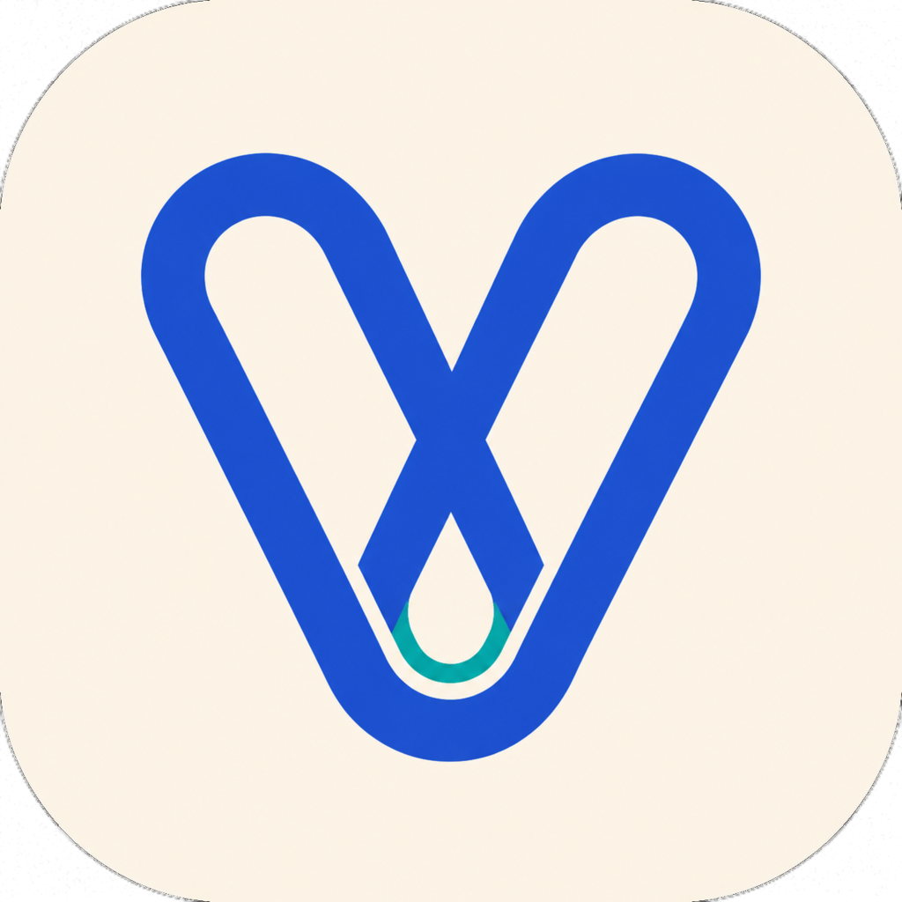

# VibeToken

<p align="center">
  
</p>

<p align="center">
  一个本地优先的 macOS 菜单栏应用，用于统计 AI 编程工具的 Token、预计费用和中转账号池额度。
</p>

<p align="center">
  <a href="README.md">English</a>
  ·
  <a href="#安装">安装</a>
  ·
  <a href="#隐私">隐私</a>
</p>

<p align="center">
  
  
  
</p>

VibeToken 面向高频使用 AI 编程工具的开发者，在一个菜单栏弹框中快速查看真实本地用量，不必反复打开多个后台页面。

> [!NOTE]
> 当前为早期预览版，已支持 22 个 AI 编程数据源，暂未提供经过 Apple 公证的公开安装包。

## 界面预览

<p align="center">
  
</p>

## 核心功能

- 自动采集 22 个 AI 编程数据源的用量，不生成模拟增量。
- 支持今天、滚动 24 小时、7 天和 30 天统计与趋势。
- 展示输入、缓存、输出、推理、模型、工具和会话分布。
- 使用带版本的 OpenAI、Anthropic 和 Google API 单价估算费用，并明确展示定价覆盖率。
- 过滤重复累计事件和 fork/subagent replay。
- 可选只读连接 Sub2API，汇总 Codex 5h/7d 账号池额度。
- 原生 macOS 菜单栏界面，支持英文和简体中文。

## 支持范围

| 数据源 | 状态 |
| --- | --- |
| Codex Desktop / CLI | 已支持：实时及归档会话，包含本地 profile |
| Claude Code + Claude Desktop Code/Cowork | 已支持：项目日志、profile 和 Cowork 会话目录 |
| Gemini CLI | 已支持：当前 JSONL、旧版 JSON 和嵌套子 Agent 会话 |
| OpenCode | 已支持：只读 SQLite，兼容旧版 JSON |
| GitHub Copilot CLI | 已支持：精确读取退出时的模型用量汇总 |
| Cursor | 已支持：读取官方账号用量导出，最多每 5 分钟请求一次 |
| Cline | 已支持：独立目录及 VS Code 系宿主任务日志，自动去除迁移副本 |
| Roo Code | 已支持：VS Code 系宿主任务日志，兼容当前及旧版索引 |
| Kiro CLI | 已支持：原生会话日志；Token 根据可观察文本明确标记为估算 |
| Grok Build TUI / CLI | 已支持：精确读取每轮用量及多模型拆分 |
| DimAgent | 已支持：只读用量账本，并去除 fork replay |
| OpenClaw | 已支持：Agent 会话、命名 profile 及旧版数据目录 |
| pi | 已支持：精确读取助手消息用量，包含缓存读取与写入 |
| Qwen Code | 已支持：Gemini 风格用量字段，拆分缓存与推理 Token |
| Kimi Code | 已支持：当前 Agent wire 及旧版 Kimi 会话目录 |
| MiMoCode | 已支持：只读 SQLite，并排除外部导入会话 |
| Amp | 已支持：优先读取 usage ledger，兼容消息级回退 |
| Droid | 已支持：累计总量准确，时间分布按观察到的增量推导 |
| Hermes | 已支持：默认及命名 profile 的 SQLite 数据库 |
| Trae CLI | 已支持：按 trace 读取模型用量并去除重复 span |
| Antigravity | 已支持：当前离线 protobuf 数据库及旧版本机语言服务回退 |
| ZCode | 已支持：只读消息用量数据库 |
| Sub2API Codex 账号池 | 已支持，可选 |

VibeToken 不会从 ChatGPT 或 Claude 桌面客户端的对话界面推断精确 Token。订阅用量与 API 单价费用不是同一口径，因此费用始终标记为预计值。

## 安装

要求：macOS 14+、Xcode 16 或 Swift 6 命令行工具。VibeToken 启动后会自动发现所有已支持数据源，不需要配置数据源、选择目录或手动扫描。某个工具不存在时会自动跳过，不影响其他可用来源。

```bash
git clone https://github.com/giraffegzy-bot/VibeToken.git
cd VibeToken
swift test
./scripts/build-app.sh
open "dist/VibeToken.app"
```

构建脚本会在 `dist/VibeToken.app` 生成 ad-hoc 签名应用，适合本机使用，但不等同于经过 Developer ID 签名和 Apple 公证的正式安装包。

### 分享方式

- 分享源码时，使用 GitHub 仓库，不要直接压缩整个开发目录；`.git`、`.build`、`dist`、本地说明和编辑器文件都不属于源码发布内容。
- 临时分享可运行程序时，只压缩 `dist/VibeToken.app`。当前版本使用 ad-hoc 签名且未经过 Apple 公证，其他 Mac 可能显示 Gatekeeper 安全提示。
- 面向普通用户正式发布时，应使用 Developer ID 签名、Apple 公证和带版本号的压缩包或 DMG。

## 使用

1. 打开 VibeToken，点击菜单栏项目。
2. 选择今天、24H、7D 或 30D。
3. 为本地用量采集选择实时、5 分钟、30 分钟或手动刷新。连接后的 Sub2API 账号池每 30 秒检查账号变化，并且每 30 分钟执行一次带验真的正式额度刷新。
4. 使用语言按钮切换英文或简体中文。

如需监控 Sub2API，在“中转额度”设置中使用管理员账号登录。首次同步后，检测为 `Plus` 的账号固定按 `Plus`（1 倍）计算；检测为 `Pro` 的账号必须手动选择 `Pro 5x`、`Pro 10x` 或 `Pro 20x`。未配置的 Pro 账号不会套用猜测默认值，配置完成前不展示账号池额度。App 启动、Mac 唤醒、用户主动刷新、账号池变化以及每 30 分钟调度，都会以 `force=true` 请求 Sub2API 官方额度探测；对于没有批量路由的正式版服务，会回退到 `source=active&force=true` 的单账号接口，并发最多 6 个请求。探测后会持续回读账号列表，直到每个活跃实体账号都得到本轮已落库且合法的 5 小时、7 天额度窗口，或具有明确的不可用、额度耗尽状态。只有整池验真通过才发布总额度；部分刷新或无法验真时不展示当前总额度，只报告已验证账号数并保留上次成功时间。VibeToken 不会重置、编辑或删除中转账号。

## 统计口径

Token 来自结构化用量字段。Kiro CLI 是例外：其原生会话日志没有 Token 计数，因此 VibeToken 会明确标记按文本估算的结果。费用按已知模型价格估算：

```text
预计费用 = 输入 * 输入单价
         + 缓存写入 * 输入单价
         + 缓存读取 * 缓存单价
         +（输出 + 推理）* 输出单价
```

未知模型不会套用猜测价格。历史用量目前按已安装版本内置的价格目录回算。

内置价格目录会记录核对日期、生效日期和 OpenAI、Anthropic、Google 官方来源地址。用量快照会按其中最近一条事件的时间选择限时价格，例如 Claude Sonnet 5 会在 2026 年 9 月 1 日结束首发价格；跨越价格切换日的统计区间仍是聚合估算，不是逐事件账单。OpenCode 的模型标识能够识别时，会自动复用对应供应商的价格。

缓存写入按普通输入价格计算。由于聚合后的本地日志无法可靠保留这些计费维度，当前不套用单次请求的长上下文阶梯，也不计算 Gemini 缓存存储时长。订阅套餐、免费额度、供应商折扣、税费和工具调用费用同样不包含在内。模型没有匹配到内置价格时，Token 仍会正常统计，界面会明确显示费用覆盖不完整或暂无定价，不会虚构单价。

价格来源：[OpenAI](https://developers.openai.com/api/docs/pricing/)、[Anthropic](https://platform.claude.com/docs/en/about-claude/pricing)、[Google Gemini](https://ai.google.dev/gemini-api/docs/pricing)。

Sub2API 的账号数量仍按真实实体账号统计；界面按套餐显示“当前可用数 / 套餐总数”，例如 `Plus 7/8 · Pro 4/4`。额度按 `Plus = 1`、`Pro 5x = 5`、`Pro 10x = 10`、`Pro 20x = 20` 加权后统一归一化为 `100%`。每个账号的实际可用额度取其 5h 和 7d 窗口剩余值中的较小值。临时不可用、明确限流、窗口耗尽、数据过期或未探测的账号仍保留在总容量分母中，但当前可用额度贡献按 `0` 计算；影子账号不重复计数。

## 隐私

- 只提取结构化用量、模型、项目、会话和时间字段；对话正文不会保存或发送。
- 各工具的 JSON/JSONL 文件和 SQLite 数据库均以只读方式访问。
- Cursor 是唯一需要访问供应商接口的用量数据源：VibeToken 仅在内存中读取 `state.vscdb` 现有 Cursor 访问令牌，并只发送到 `https://cursor.com` 获取官方用量 CSV；令牌和响应正文不会持久化或写入日志。
- 旧版 Antigravity `.pb` 历史只通过其已运行的 `127.0.0.1` 本机语言服务解码；CSRF Token 仅在内存中使用且不会写入日志。当前 Antigravity `.db` 历史直接离线只读。
- 用量索引保存在本机应用支持目录。
- 日志不记录 Token、密码、Cookie、账号地址或响应正文。
- Sub2API 登录信息保存在受限权限的本地文件中，不使用 macOS Keychain。与 Keychain 相比，同一 macOS 用户权限下的其他进程更容易读取这些文件。

## 开发

VibeToken 是独立的 Swift 实现，运行时不依赖其他用量统计工具；每个适配器直接读取对应工具的结构化本地数据或公开账号用量导出。

```bash
swift build
swift test
```

修改数据源、统计公式、持久化结构或安全边界前，请先阅读 [CONTRIBUTING.md](CONTRIBUTING.md)。

## 许可证

[MIT](LICENSE)
